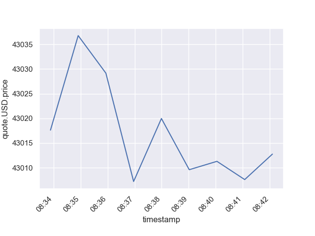
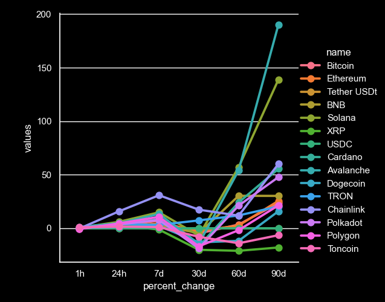

# Crypto Currency Tracker

## Introduction
This program leverages the CoinMarketCap API to track changes in cryptocurrency values. Users can configure the program to refresh data at desired intervals, allowing for up-to-date insights into cryptocurrency market movements. The gathered data is stored in two CSV files: `bitcoin.csv` for tracking Bitcoin price changes, and `top15_crypto.csv` for comparing the top 15 cryptocurrencies.

## Features
- Fetch and refresh cryptocurrency data at user-defined intervals.
- Store cryptocurrency data in CSV files for Bitcoin and the top 15 cryptocurrencies.
- Generate visualizations for the stored data (images to be added).

## Getting Started

### Prerequisites
- Python 3.x
- Required Python packages: `requests`, `pandas`, `seaborn`, `matplotlib`

### Installation
1. Clone the repository to your local machine
2. Navigate to the cloned repository directory.
3. Install the required Python packages.

### API Key
You must obtain an API key from [CoinMarketCap](https://pro.coinmarketcap.com/) to use this program. Once obtained, replace the placeholder in the code with your actual API key.

Follow the on-screen prompts to choose how many times you wish to refresh the data and the refresh interval (in seconds).

### CSV Output
- `bitcoin.csv`: Contains the price changes of Bitcoin over the specified intervals.
- `top15_crypto.csv`: Compares the top 15 cryptocurrencies based on the specified metrics.

## Visualizations
After running the program, two images representing the data from `bitcoin.csv` and `top15_crypto.csv` are generated.

*Bitcoin Price Changes Over Time*

*Comparison of Top 15 Cryptocurrencies*

## Contributing
Contributions to improve this project are welcome. Please feel free to fork the repository, make changes, and submit pull requests.

## License
This project is open source and available under the [MIT License](LICENSE.md).